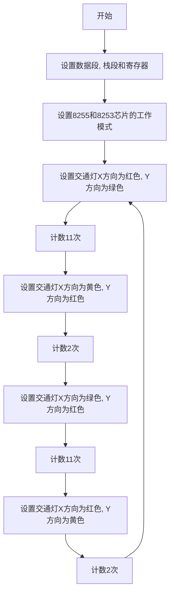
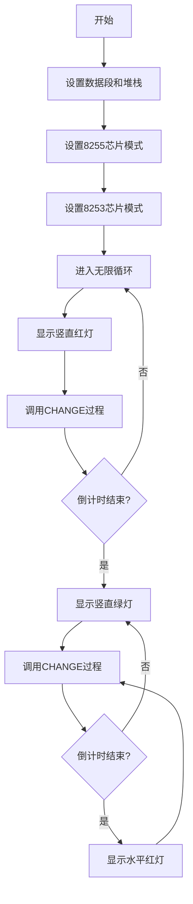

本实验使用LED显示单元及两组数码管模拟十字路口交通灯和倒计时显示变化情况，场景示意图如下：

由于相对方向的交通灯和倒计时变化规律相同，因此只需要设计两个交通灯和两个倒计时的显示。每个交通灯使用红黄绿三个 LED 来模拟，每个倒计时使用两组数显管模拟。交通灯和倒计时与接口连接方式如下图：

A0～A5 接六个 LED 灯，两组数显管使用片选方式，每个倒计时只需要使用八个接口，即 B0～B7（C0～C7）。

当8254计数完成，检测到与8255链接的端口电频变化后，倒计时减1，倒计时为0后灯光变化。交通灯和倒计时的变化规律如下：

1. 南北路口的绿灯亮，倒计时从12s到0s，南北路口的红灯亮，倒计时从15s到0s。
2. 12s过后，南北路口的黄灯闪烁，倒计时从3s到0s，
3. 3s过后，南北路口的红灯亮，倒计时从15s到0s，东西路口绿灯亮，倒计时从12s到0s。
4. 12s过后，东西路口的黄灯闪烁，倒计时从3s到0s。
5. 重复1～4。

可以将交通灯和倒计时的所有情况存为两个数组，方便取用。 

交通灯的所有变化情况如下：

| A0   | A1   | A2   | A3   | A4   | A5   | 指示情况                   |
| ---- | ---- | ---- | ---- | ---- | ---- | -------------------------- |
| 0    | 0    | 1    | 1    | 0    | 0    | 南北方向绿灯，东西方向红灯 |
| 0    | 1    | 0    | 1    | 0    | 0    | 南北方向黄灯，东西方向红灯 |
| 1    | 0    | 0    | 0    | 0    | 1    | 南北方向红灯，东西方向绿灯 |
| 0    | 0    | 1    | 0    | 1    | 0    | 南北方向红灯，东西方向黄灯 |

 倒计时的所有变化情况如下，其中B7/C7为0时代表控制十位数字，B7/C7为0时代表控制个位数字：

| B0/C0 | B1/C1 | B2/C2 | B3/C3 | B4/C4 | B5/C5 | B6/C6 | B7/C7 | 数字显示情况 |
| :---: | :---: | :---: | :---: | :---: | :---: | :---: | :---: | :----------: |
|   0   |   0   |   0   |   0   |   0   |   0   |   0   |   0   |    显示0     |
|   0   |   1   |   1   |   0   |   0   |   0   |   0   |   0   |    显示1     |
|   0   |   0   |   0   |   0   |   0   |   0   |   0   |   1   |    显示0     |
|   0   |   1   |   1   |   0   |   0   |   0   |   0   |   1   |    显示1     |
|   1   |   1   |   0   |   1   |   1   |   0   |   1   |   1   |    显示2     |
|   1   |   1   |   1   |   1   |   0   |   0   |   1   |   1   |    显示3     |
|   0   |   1   |   1   |   0   |   0   |   1   |   1   |   1   |    显示4     |
|   1   |   0   |   1   |   1   |   0   |   1   |   1   |   1   |    显示5     |
|   1   |   0   |   1   |   1   |   1   |   1   |   1   |   1   |    显示6     |
|   1   |   1   |   1   |   0   |   0   |   0   |   0   |   1   |    显示7     |
|   1   |   1   |   1   |   1   |   1   |   1   |   1   |   1   |    显示8     |
|   1   |   1   |   1   |   1   |   0   |   1   |   1   |   1   |    显示9     |

电路板焊接设计：

在实际焊接之前，应考虑整体布局，如怎么排版电子元件使正面美观的同时，背后焊接连线较少，连锡较多。因为电路板最外侧两圈引脚分别互联，所以可以利用其内外圈分别为电源和接地，减少连线数量。

基于交通灯的功能实现，LED灯表示的红黄绿灯排版分为南北，东西方向，数码管应尽可能与LED灯放置在一起。

